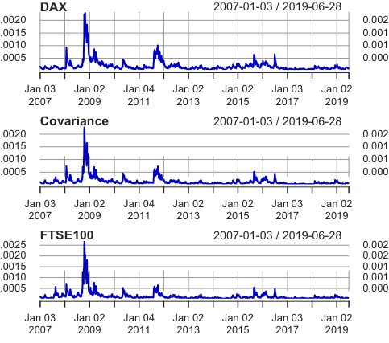

[](http://quantlet.de/)

## [](http://quantlet.de/) **SFEustb** [](http://quantlet.de/)

```yaml

Name of QuantLet: SFEmvol02

Published in: Statistics of Financial Markets

Description: 'Estimates parameters of a multivariate GARCH model for the daily log-returns 
of DAX and FTSE100 from 01.01.2007 to 29.06.2019. It also plots the estimated variance and 
covariance processes.'

Keywords: covariance, garch, multivariate analysis, volatility, log-returns

See also: SFEmvol1

Author: Guillermo Morishige

Submitted: Sun, June 30 2019 by Guillermo Morishige

Datafiles: None

Example: Estimated variance and covariance for DAX and FTSE 100
returns from 2007-2019 using a DCC-GARCH(1,1) model 

```




### R Code:
```r
#install.packages(c("quantmod","rugarch","rmgarch"))
library(quantmod)
library(rugarch)
library(rmgarch)

# clear variables and close windows
rm(list = ls(all = TRUE))
graphics.off()

#get data
startDate=as.Date("2007-01-01") #choose start date
getSymbols(c("^FTSE","^GDAXI"),src="yahoo",from=startDate)

#combine in dataframe and remove NAs
df=cbind(FTSE,GDAXI)
df = df[df$FTSE.Close!=".", ]
df = df[df$GDAXI.Close!=".", ]

#compute log returns
DAX = df$GDAXI.Close
FTSE = df$FTSE.Close
df$log_ret_dax <- diff(log(DAX), lag=1)
df$log_ret_ftse <- diff(log(FTSE), lag=1)
df = df[df$log_ret_dax!=".", ]

#compute univariate GARCH to get coefficients
ret=cbind(df$log_ret_ftse,df$log_ret_dax)
uspec.n=multispec(replicate(2, ugarchspec(mean.model=list(armaOrder=c(1,0)))))
multf=multifit(uspec.n, ret)
#print
multf

#state specifications for multivariate GARCH model
spec1=dccspec(uspec=uspec.n, dccOrder = c(1,1), distribution = 'mvnorm' )

#Model Estimation of covariances and correlations
fit1=dccfit(spec1, data = ret, fit.control = list(eval.se = TRUE), fit = multf)
fit1
cov1=rcov(fit1)
cor1=rcor(fit1)

#plot
par(mfrow=c(3,1))
plot(as.xts(cov1[2,2,]),main="DAX", col="blue3")
plot(as.xts(cov1[2,1,]),main="Covariance", col="blue3")
plot(as.xts(cov1[1,1,]),main="FTSE100", col="blue3")

```
